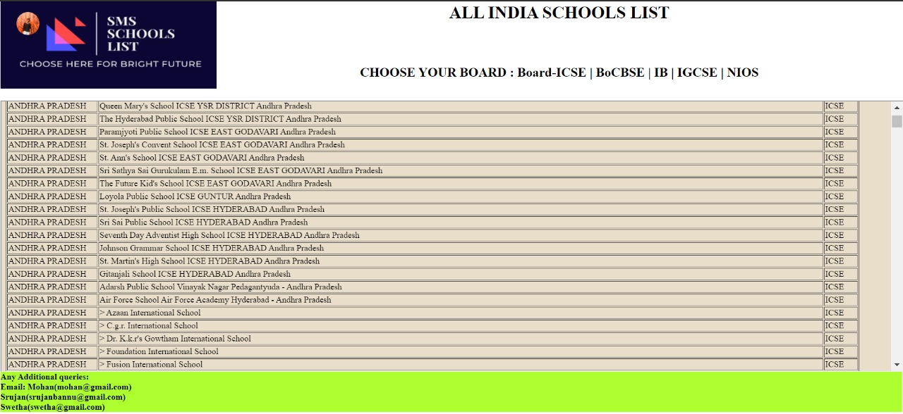
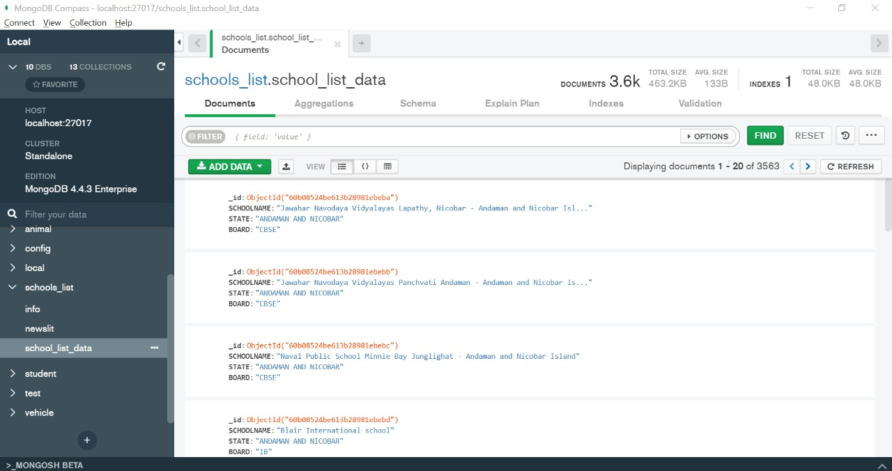

# SMS-schools-list

This project focuses on creating a web application to provide effective assistance to find schools list all over INDIA. SMS schools list generate a simple report from a mongo dB (excel) file containing the details and state vise schools.
The main aim of this project is to help people to choose a school is available in their locality or state. The data which is available can quickly generate a report of the schools in and around your state. In advance we are going to separate the columns by the fees, teachers and other aspects. This application requires an email id and password to sign in the website. Select the state and board which you are interested in. When the list of schools has been generated, it is automatically displayed on the web page where you can check the schools around you.
# Main Page:

# Mongo DB:

# NIOS Page:

